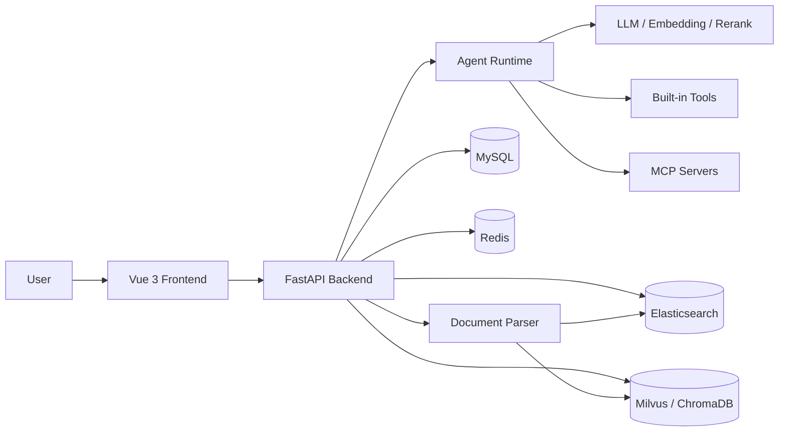

<div align="center">

# AgentChat

面向多模型、多工具与知识库场景的智能体对话平台。

<p>
  
  
  
  
  
</p>

<p>
  <a href="#项目简介">项目简介</a> ·
  <a href="#核心能力">核心能力</a> ·
  <a href="#快速开始">快速开始</a> ·
  <a href="#安全配置">安全配置</a> ·
  <a href="#docker-部署">Docker 部署</a>
</p>

</div>

---

## 项目简介

AgentChat 是一个前后端分离的智能体应用平台。它把大模型对话、工具调用、RAG 知识库、MCP 服务、多智能体工作流和用量统计整合到同一套工作台中，适合用来搭建个人 AI 助手、企业知识问答、工具型 Agent、研究型搜索助手或多模型实验平台。

后端使用 FastAPI、LangChain、LangGraph、MCP、SQLModel、Redis、MySQL、Elasticsearch 与向量数据库构建；前端使用 Vue 3、Vite、TypeScript、Element Plus、Pinia 与 ECharts 构建。

## 核心能力

| 模块 | 能力 |
| --- | --- |
| 多模型接入 | 独立配置对话模型、工具调用模型、推理模型、Embedding、Rerank、视觉模型与文生图模型。 |
| 智能体工作台 | 管理 Agent、技能、工具、模型、MCP Server、会话历史、工作区任务和用量统计。 |
| RAG 知识库 | 支持 PDF、Word、Excel、Markdown、TXT、图片等文档解析、分块、向量检索和关键词检索。 |
| 工具调用 | 内置搜索、天气、论文检索、网页抓取、文件转换、图片理解、邮件、快递查询等工具。 |
| MCP 集成 | 支持项目内置 MCP Server，也支持将外部 MCP 服务接入智能体运行时。 |
| 可观测性 | 记录模型调用、Token 使用、Agent 维度统计和历史消息，便于排查与复盘。 |

## 架构概览



## 技术栈

| 层级 | 技术 |
| --- | --- |
| 后端服务 | Python 3.12+, FastAPI, Uvicorn, Pydantic, SQLModel |
| 智能体 | LangChain, LangGraph, MCP |
| 数据存储 | MySQL, Redis |
| 检索增强 | Elasticsearch, Milvus, ChromaDB |
| 前端应用 | Vue 3, Vite, TypeScript, Element Plus |
| 前端状态与图表 | Pinia, Vue Router, Axios, ECharts |
| 部署 | Docker, Docker Compose, Nginx |

## 目录结构

```text
AgentChat/
├─ docker/                    # Docker、Compose、Nginx 与生产配置模板
├─ docs/                      # 公开的代码、接口、数据库与架构文档
├─ scripts/                   # 本地启动和维护脚本
├─ src/
│  ├─ backend/
│  │  ├─ agentchat/
│  │  │  ├─ api/              # FastAPI 路由与接口服务
│  │  │  ├─ config/           # 工具和 MCP 默认配置
│  │  │  ├─ core/             # 模型、Agent、回调等核心能力
│  │  │  ├─ database/         # SQLModel 模型、DAO 与初始化逻辑
│  │  │  ├─ mcp_servers/      # 内置 MCP Server
│  │  │  ├─ prompts/          # Prompt 模板
│  │  │  ├─ schema/           # 请求与响应数据结构
│  │  │  ├─ services/         # RAG、MCP、记忆、搜索、工作区等服务
│  │  │  ├─ tools/            # 内置工具实现
│  │  │  ├─ main.py           # FastAPI 应用入口
│  │  │  └─ settings.py       # YAML 配置加载
│  │  └─ fastapi_jwt_auth/    # 项目内兼容版本 JWT 认证模块
│  └─ frontend/
│     ├─ src/
│     │  ├─ apis/             # API 请求封装
│     │  ├─ components/       # 通用组件
│     │  ├─ pages/            # 业务页面
│     │  ├─ router/           # 路由配置
│     │  ├─ store/            # Pinia 状态管理
│     │  └─ utils/            # 通用工具函数
│     └─ package.json
├─ pyproject.toml
├─ requirements.txt
└─ README.md
```

## 快速开始

### 1. 准备基础服务

本地开发通常需要：

- MySQL
- Redis
- Elasticsearch，可按需关闭
- Milvus 或 ChromaDB，可按配置选择

请确保 `src/backend/agentchat/config.yaml` 中的连接地址和你的实际服务一致。

### 2. 准备后端配置

```powershell
Copy-Item src/backend/agentchat/config.example.yaml src/backend/agentchat/config.yaml
```

然后在 `config.yaml` 中填写本地数据库、模型服务、搜索服务和对象存储配置。

### 3. 安装后端依赖

```powershell
python -m venv .venv
.\.venv\Scripts\Activate.ps1
python -m pip install -U pip
pip install -r requirements.txt
```

### 4. 启动后端

```powershell
cd src/backend
uvicorn agentchat.main:app --host 0.0.0.0 --port 7860 --reload
```

健康检查：

```text
http://localhost:7860/health
```

### 5. 启动前端

```powershell
cd src/frontend
npm install
npm run dev
```

默认访问地址：

```text
http://localhost:5173
```

### 6. 一键开发启动

项目也提供了本地启动脚本：

```powershell
python scripts/start.py
```

## 安全配置

请不要把真实 API Key、数据库密码、JWT 密钥、OSS AccessKey、Webhook Token 或任何个人配置提交到公开仓库。

本项目约定：

| 文件 | 用途 | 是否提交 |
| --- | --- | --- |
| `src/backend/agentchat/config.example.yaml` | 后端配置模板 | 是 |
| `src/backend/agentchat/config.yaml` | 本地真实配置 | 否 |
| `docker/config.production.example.yaml` | Docker 生产配置模板 | 是 |
| `docker/config.yaml` | Docker 真实配置 | 否 |
| `docker/docker.env.example` | Docker 环境变量模板 | 是 |
| `docker/docker.env` | Docker 真实环境变量 | 否 |

如果真实密钥曾经被提交过，加入 `.gitignore` 只能防止后续再次提交，不能让旧提交变安全。请立即轮换对应平台的密钥；如果公开仓库历史中已经包含密钥，还需要清理 Git 历史后再推送。

## Docker 部署

```powershell
Copy-Item docker/config.production.example.yaml docker/config.yaml
Copy-Item docker/docker.env.example docker/docker.env
cd docker
docker compose up -d
```

常用文件：

| 文件 | 说明 |
| --- | --- |
| `docker/docker-compose.yml` | 基础 Compose 配置 |
| `docker/docker-compose.prod.yml` | 生产部署配置 |
| `docker/nginx.conf` | 前端静态资源与后端代理配置 |
| `docker/config.production.example.yaml` | 生产配置模板 |
| `docker/docker.env.example` | 环境变量模板 |

## 常用命令

```powershell
# 后端依赖
pip install -r requirements.txt

# 后端开发
cd src/backend
uvicorn agentchat.main:app --port 7860 --reload

# 前端开发
cd src/frontend
npm run dev

# 前端构建
npm run build

# 前端类型检查
npm run lint
```

## 公开文档

仓库中保留公开的代码级文档，便于理解接口、数据库、架构和服务边界：

| 文档 | 说明 |
| --- | --- |
| `docs/api.md` | API 接口说明 |
| `docs/database.md` | 数据库结构说明 |
| `docs/core.md` | 核心模块说明 |
| `docs/service.md` | 服务层说明 |
| `docs/backend-architecture.md` | 后端架构说明 |
| `docs/backend-files-analysis.md` | 后端文件结构说明 |
| `docs/migration.md` | 迁移记录 |
| `docs/agentchat.sql` | 数据库初始化 SQL |

其他本地资料默认不进入公开仓库。

## 提交前检查

提交前建议执行：

```powershell
git status --short
git diff --cached --name-only
git grep -n -I "api_key\|secret_key\|access_key\|password\|token" -- . ":!docs/*" ":!*.example*" ":!*.md"
```

如果发现真实密钥，请先移除或改成本地配置/环境变量后再提交。

## License

本项目基于 MIT License 开源，详见 `LICENSE`。
